Zunaid Mougaidinessaib  
Gautier Dermont  
Mennan Selvaruaban  
---
# PROJET LISTING DEPART 
```
git clone https://github.com/GautierDERMONT/Projet_Docker.git
```
```
docker-compose up -d --build
```

puis
```
bash ./setup.sh 
```

copier et coller ce lien dans le navigateur :  
127.0.0.1:8008 ou http://localhost:8008/

2 comptes pour le site :
compte jury :
login : jury
mdp : password

compte entrée de piste :
login : entree
mdp : password

---

<br><br>  

Voici la page d'accueil :  
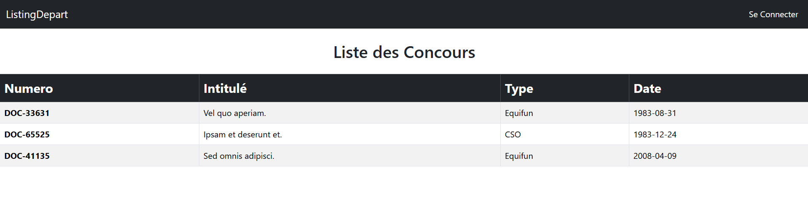  

<br><br>  

On peut se connecter via le bouton Se Connecter en haut à droite, nous redirigeant vers une page de connexion :  
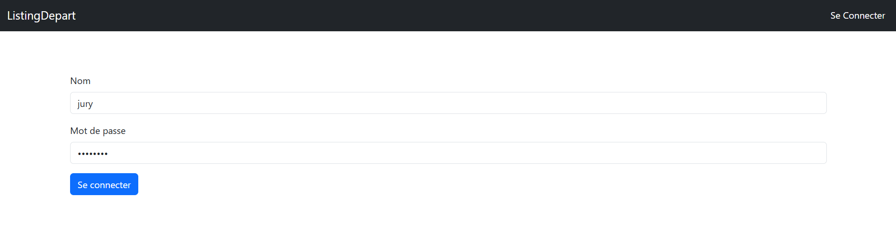  

<br><br>  

Page d'accueil après s'être connecté :  
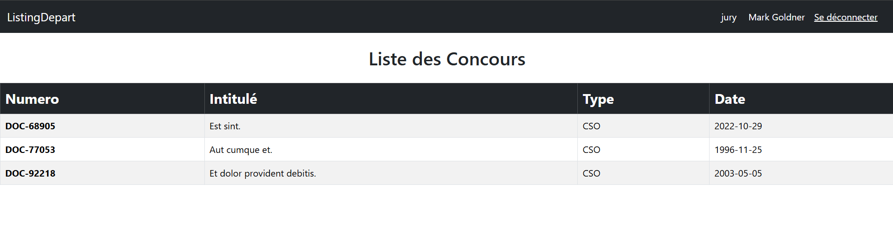  

<br><br>  

On peut appuyer sur un concours pour voir ses épreuves ainsi que les couples des épreuves :  
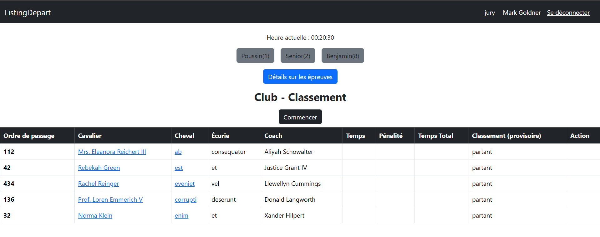  

<br><br>  

On peut accéder à une liste synthétique des épreuves du concours en appuyant sur Détails sur les épreuves :  
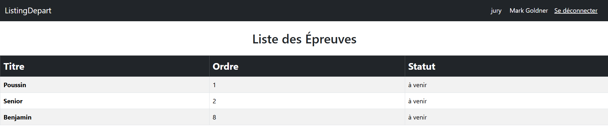  

<br><br>  

Le jury peut modifier un couple :  
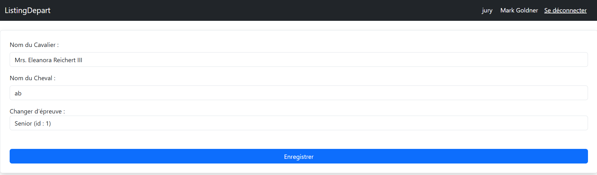  

<br><br>  

Le jury peut commencer une épreuve en appuyant sur Commencer (le bouton Commencer n'est visible que pour un compte Jury), on peut voir que l'épreuve qui a été commencée devient vert et va tout à gauche :  
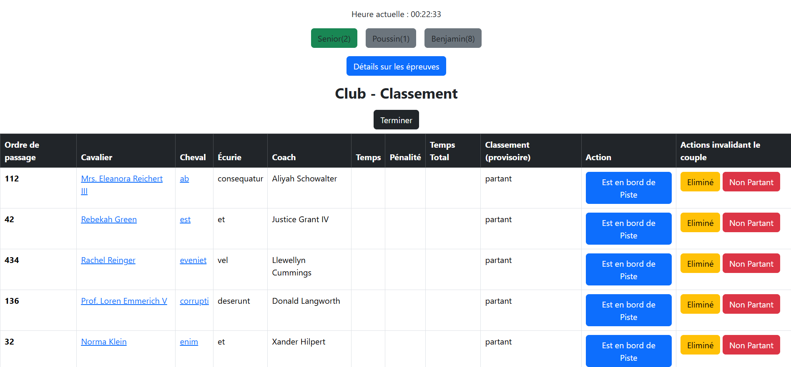  

<br><br>  

La personne à l'entrée de piste a quelques droits maintenant que l'épreuve a commencé, on peut voir qu'il peut changer le statut d'un couple, de non partant à en bord de piste ainsi que d'en bord de piste à en piste. Nous pouvons voir qu'il n'a plus d'autres actions possibles après avoir mis un couple en piste :  
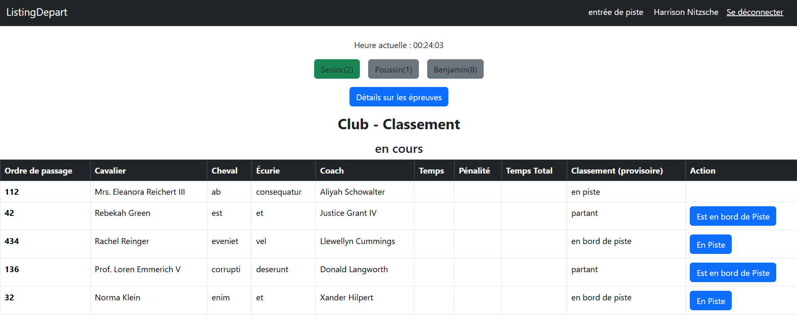  

<br><br>  

La page se rafraîchissant automatiquement, les modifications apportées par la personne à l'entrée de piste s'affichent pour le jury :  
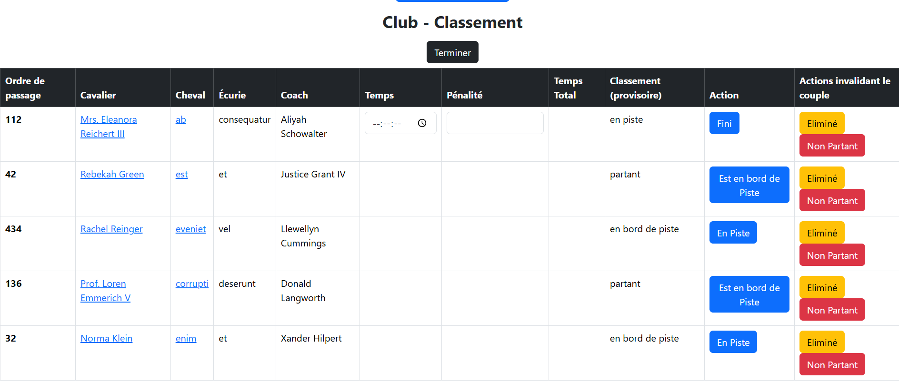  

<br><br>  

Le jury lui a les mêmes droits que la personne à l'entrée de piste mais a aussi le droit d'indiquer qu'une personne a fini son parcours, cependant pour qu'il puisse appuyer sur le bouton Fini, le jury doit impérativement remplir le temps effectué par le couple ainsi que le nombre de pénalités.  

De plus, il peut aussi indiquer si une personne est non partante ou éliminé. Dans ces deux cas de figures, les couples sont placés tout en bas du classement :    
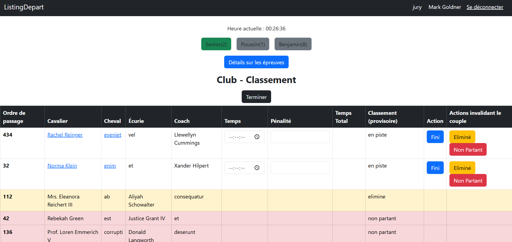  

<br><br>  

Une fois que tous les couples ont été gérés, le jury peut terminer l'épreuve. Ainsi l'épreuve passe en rouge et va tout à droite :  
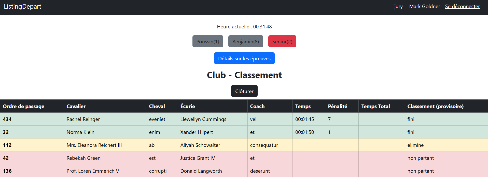  

<br><br>  

En appuyant sur le bouton clôturer, le temps total est calculé et le classement définitif est fait :  
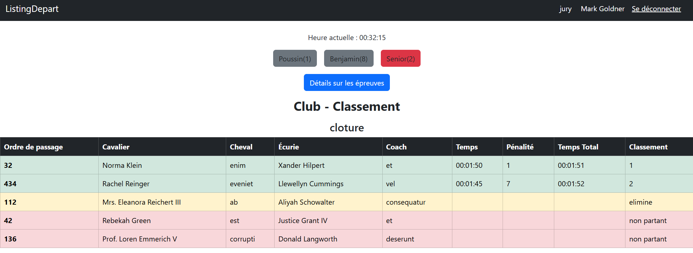  


